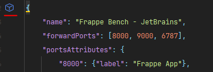
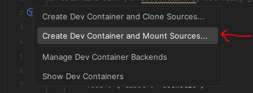

# Creating a Development Environment

The following has been developed on a Linux distro such as Ubuntu (Recommended)

## Table of Contents
1. [VS Code Setup](#vs-code-setup)
2. [Jetbrains Setup](#jetbrains-setup)
3. [Default Parameters](#default-parameters)

### VS Code Setup

1. Pull the repo to your local machine: `git clone https://github.com/Henry-Do-Su/frappe_deployer`

2. Make sure you have installed the Dev Containers Extension in VS Code (ID: ms-vscode-remote.remote-containers).

3. If the extension is installed, you will see a green icon in the bottom left corner of VS Code. Click on it and select "Open Folder in Container".

4. Once in the container: `cd development`

5. Edit apps.json to include the apps you want to install in your development environment. If the App you want to install is a private repo,
you will need to include your PAT key in the URL. 

For example: `"url": "https://github.com/MYACCOUNT/MYAPP.git"",` becomes `"url": "https://<PAT_KEY>@github.com/MYACCOUNT/MYAPP.git"`"

**Note:** The next step will install Frappe v15, Python Version 3.11.6, Node v18.18.2 and the apps listed in apps.json.

You can run `python -V` to check the python version and `node -v` to check the node version, use these in your ./installer flags.
6. Run `./installer.py` or `./installer.py -t version-15 -p 3.11.6 -n v18.18.2 -j apps.json -v`

**Note** If you want to change any default parameters for the installation, edit the installer.py file and change the default parser values.

7. Once the installation is complete, you can run `bench start` to start the development server. You can access the site at `localhost:8000`

### Jet Brains Setup

In this example, we will be using PyCharm Professional Edition. The following steps should be similar for other JetBrains IDEs.

1. Pull the repo to your local machine: `git clone https://github.com/Henry-Do-Su/frappe_deployer`

2. Replace the devcontainer.json file in the root directory with the devcontainer.json file in the jetbrains directory.

3. Initiate the Container by clicking on the Virtual Container Image inside of the devcontainer.json file:

**NOTE** If you want to launch the container locally or remotely using JetBrains Gateway, follow this guide: https://www.jetbrains.com/help/idea/connect-to-devcontainer.html#start_from_gateway

4. Once in the container: `cd development`

5. Edit apps.json to include the apps you want to install in your development environment. If the App you want to install is a private repo,
you will need to include your PAT key in the URL. 

For example: `"url": "https://github.com/MYACCOUNT/MYAPP.git"",` becomes `"url": "https://<PAT_KEY>@github.com/MYACCOUNT/MYAPP.git"`"

**Note:** The next step will install Frappe v15, Python Version 3.11.6, Node v18.18.2 and the apps listed in apps.json.
You can run `python -V` to check the python version and `node -v` to check the node version, use these in your ./installer flags.

6. Run `./installer.py` or `./installer.py -t version-15 -p 3.11.6 -n v18.18.2 -j apps.json -v`

**Note** If you want to change any default parameters for the installation, edit the installer.py file and change the default parser values.

7. Once the installation is complete, you can run `bench start` to start the development server. You can access the site at `localhost:8000`

## Default Parameters
Site Name: `development.localhost`

Default Port: `8000`

Default Admin User: `Administrator`

Default Admin Password: `admin`

Default Database Type: `mariadb`

Default Database Password: `superpassword`

